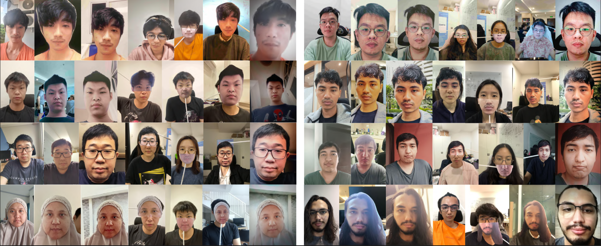
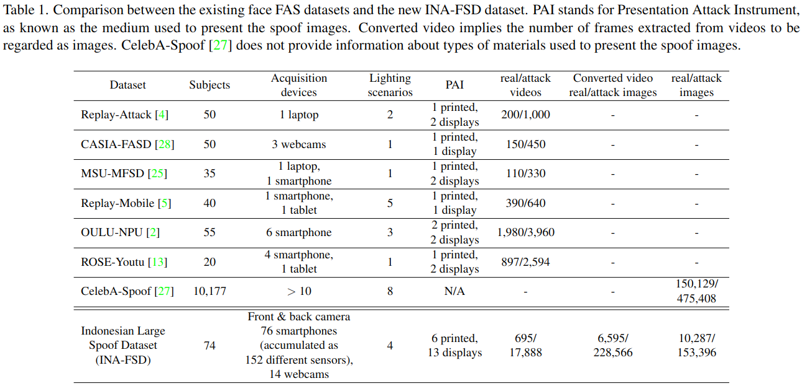
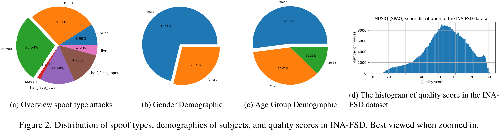

THIS REPO IS STILL IN WORKING PROGRESS

# INA-FSD: The Comprehensive Smartphone and Webcam Face Spoofing Dataset

[Hanry Ham](https://github.com/hamhanry), [I Putu Agi Karasugi](https://github.com/agikarasugi), [Williem](https://github.com/williem-scientist)

## Description

Most FAS models are evaluated for their generalization capabilities by testing on an excluded set of conditions. However, the most commonly used datasets and protocols cover only 2D printed paper and display attacks and have limited variation of spoof medium and capture sensors. Moreover, only a few datasets have distinct information on image quality and protocol exploring their effect on FAS. 

To explore this area, we present a new dataset, Indonesian Face Spoof Dataset (INA-FSD) that consists of 74 subjects, with 76 smartphone models and 14 webcam models for acquisition devices, totaling 398,844 final images. To explore the effect of image quality on the performance of FAS models, an image-quality-based out-of-distribution protocol is proposed based on the INA-FSD dataset that differentiates multiple camera hardware types and their quality. 

Experiments are conducted on three state-of-the-art methods on the proposed protocols: SSDG-R, SA-FAS, and DiVT. Results indicate that state-of-the-art FAS methods still have much to improve on generalization across image quality domains. Additionally, the combination of quality domains for training dramatically affects performance in a limited domain scenario.

## Our dataset compared to the other FAS dataset

### Distribution

## Cite

The work will be presented in Workshop of Efficient Learning for Face Analysis at WACV 2024.

## Download

To download the dataset and the protocols, you must submit a form and end user license agreement (EULA). The download link will be provided via email.

The link to the form and EULA will be given in late January 2024.
